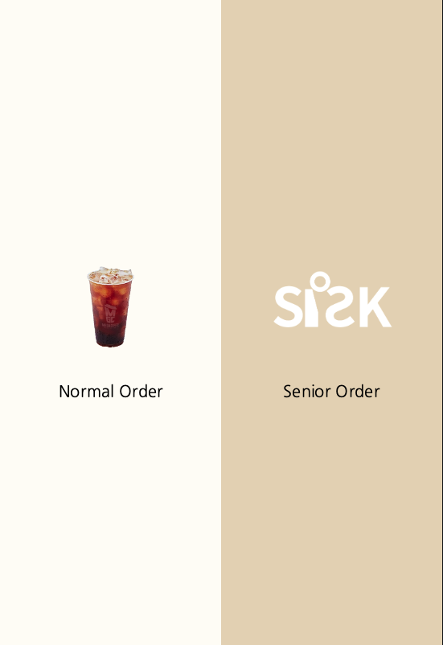
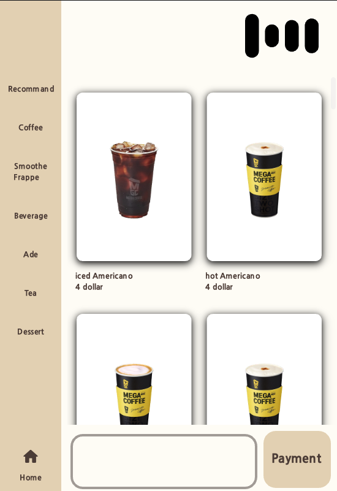

 How to clone 

    git clone --recurse-submodules https://github.com/diddmstjr07/SioPackage_en.git

 
Way to Process for Windows

    -> Just Double click setup.exe file 
    -> Wait while loading completed (!!Important!! Don't close windows of setup.exe even load is completed)
    -> Double click main.exe file

 
Way to Process for Unix

    -> Turn on Terminal and Type Command as
    
    -> "sh setup.sh"
    -> "sh main.sh"

 

  
  

 
Way to use Siosk

    -> After double clicking setup.exe and main.exe three windows will be pop up.

    -> 1. Kiosk User Interface Screen
    -> 2. Client-Backend Console windows
    -> 3. Server-Backend Console windows

    -> You can also order menu as people usually do
    -> Following main.exe display Console, you can speak to Gemini AI Model to order menu

 
Example Question list

    Q. Hello A. ~~~~
    Q. Give me an iced Americano A. ~~~
    Q. Give me one A. ~~~~
    Q. Give it to me cold A. ~~~~
    Q. Okay A. ~~~~
    Q. I will pay A. ~~~~

 

Introducing Video

    

